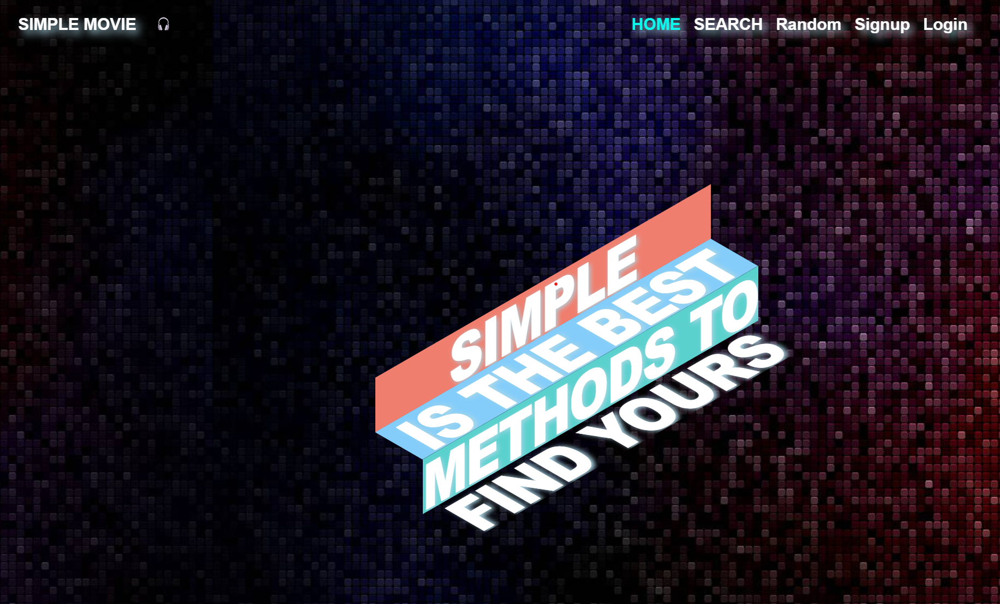

### Resume

<<<<<<< HEAD
[**여기**](https://verdant-fruitadens-7f2.notion.site/RESUME-cd848611573045adbce9b8c097034157)
=======

안녕하세요, 개발을 즐겁게 공부중인 이현홍입니다. 일상의 수 많은 데이터 속에서 유의미한 정보를 찾는 연습을 하고 있습니다.

Contact.

📧 **lhh6239@naver.com**

📞 **010-4105-1012**

Site.

<a href="https://github.com/Heruing">**github.com/Heruing**</a>

Experience & Education.

- 
부스트캠프 AI tech

  

 

  - **Period.** 2022-01-17 ~

  - **About.** 네이버 커넥트 재단 운영 부스트캠프 AI tech 3기, Computer Vision

  - **Realized.** 

    1. Data analysis & Preprocessing
    2. AI Engineering

    이론적으로는 Pytorch, Numpy & Pandas를 포함 기초 AI Math부터 최근 사용되는 기술에 대한 흐름을 이해할 수 있는 강의를 수강하였습니다. 뿐만 아니라 대회형 프로젝트를 통해  Kaggle과 같이 제공된 Dataset을 활용해 다양한 방법으로 성능을 높이는 작업을 익혔습니다. 해당 과정에서 Data의 양과 분포 등의 특성을 파악하기 위한 EDA, Visualization을 진행하며 데이터에 대한 다방면적 분석을 경험하였습니다. 특히, 이를 기반으로 이후 실험 방향성과 보완점을 발견할 수 있음을 깨달아 Data Analysis에 대한 다양한 고찰을 진행하고 있습니다.

- 
삼성 청년 SW 아카데미

  

  - **Period.** 2021-07-07 ~ 2021-12-31

  - **About.** 6기, 비전공자(Python) Track

  - **Realized.** 

    1. 풀 스택 웹 개발 경험 → MVC패턴, RDBMS, UI/UX, Request/Response
    2. 객체 지향형 프로그래밍, 알고리즘, CS
    3. 문제의 인식과 일상 문제 해결에 대한 고찰

    SW 인재 양성 교육 프로그램으로, Python Track의 경우 Django BE와 Vue FE를 활용한 풀스택 웹 개발을 경험하였습니다. 해당 과정을 통해 ERD설계 및 서비스 구성 등 프로젝트 전반에 대한 절차를 익혔습니다. 특히 개발자로서 가장 중요한 문제의 인식과 해결에 대한 고민을 할 수 있게끔 성장할 수 있었습니다.

- **질병관리청**(2020-06-29 ~ 2021-01-04)

- **부산대학교 분자생물학과**(2013-03 ~ 2020-02)

About Me.

- **개발자로서의 '나'**
  - 데이터를 탐구하고 연구합니다.
    데이터 속에서 인사이트를 뽑는 것은 결국 인간의 영역이라 생각합니다.
    공부를 하면 할 수록 엄청난 데이터 속에서 유의미한 것은 무엇인가에 대한 고민을 하게 되었습니다.
    정보의 바다에서 우리에게 필요한, 유효한 것을 찾아 작업을 개선할 수 있는 어부가 되겠습니다.
  - 사용자의 경험을 최우선적으로 고민합니다.
    처음 진행했던 프로젝트를 통해 사용자 친화를 최대의 목표로 개발한 경험이 있습니다.
    언제나 사용자가 원하는 데이터와 구성을 생각하여 개발에 임하고 있습니다.
- **구성원으로서의 '나'**
  - 구성원을 존중합니다.
    하나의 팀으로 최대의 효율을 뽑기 위해 개인의 능력치도 중요하지만, 팀원들과의 화합을 최우선 요소로  생각합니다. 또한, 소통 과정에서 발생하는 무수한 가능성을 긍정적으로 생각하고 있습니다.
  - 소속감을 가집니다.
    언제나 나 하나의 잘못된 행동이 구성원들의 얼굴에 먹칠을 할 수 있다는 생각을 가지고 있습니다.
    업무적 성장이 나의 성장으로 다가올 것을 믿고, 그렇게 될 수 있도록 다양한 개선 방식을 고려합니다.
  - 강한 책임감을 가지고 일합니다.
    '일'을 하는 사람은 모두 프로라는 마음가짐을 가지고 있습니다.
    주어진 업무에 그치지 않고,  배경까지 탐구하는 것이 조직원으로서 제가 가진 자세입니다.
- **학습한 것**(상세내용 하단 기재)
  - **부스트캠프 AI tech 3기** **(2022-01-17 ~ )**
    네이버 커넥트재단에서 운영하는 부스트캠프 AI tech 3기, CV domain을 수강하고 있습니다.
    **삼성 청년 SW 아카데미** **(2021-07-07 ~ 2021-12-31)**
    삼성 청년 SW 아카데미에서 1학기를 이수하며 Python, Django, Vue를 활용한 풀스택 웹 개발 경험이
    있습니다.

Project.

1. **Sementic Segmentation**

   - **Name. ** 재활용 품목 분류를 위한 Semantic Segmentation

   - **Period.** 2022-04-25 ~ 2022-05-12

   - **Site.** https://github.com/boostcampaitech3/level2-semantic-segmentation-level2-cv-05

   - **About.**
     쓰레기 이미지 데이터에서 각 클래스에 따라 mask를 생성하는 대회입니다. 
   - **Job.**
     - EDA
     - Data Augmentation
     - Data Cleansing
     - Data Visualization

   - **Realized.**
     1. 실험의 종류에 따른 소요 시간
        기존에 수행했던 실험들은 모델에 따른 차이 정도였으나 Sementic Segmentation의 경우 process적 특성으로 시간이 오래 걸림 → 이에 따른 실험 설계를 했어야 함
     2. 각 기법의 상호보완적 활용에 대하여
        해당 태스크에서 실험해보진 않았지만, Object Detection과 함께 한다면 상호 보완적인 결과를 낼 수 있을 것이라 생각 됨

2. **OCR**

   - **Name. ** 글자 검출 대회
   - **Period.** 2022-04-14 ~ 2022-04-21
   - **Site.** https://github.com/boostcampaitech3/level2-data-annotation_cv-level2-cv-05
   - **About.**
     사진내 글자의 위치를 파악하는 대회. 이번 대회의 경우 직접 데이터 셋을 제작하는 과정이 있었습니다. 대회 취지에 맞게 데이터를 다루는 것에 집중하여 데이터 전수조사와 EDA를 통한 데이터에 대한 다양한 인사이트를 도출해 보았습니다.
   - **Job.**
     - Set Dataset
     - Data Cleansing
     - Data Augmentation
   - **Realized.**
     1. EDA를 통한 데이터 분석 및 Cleansing
        주어진 데이터셋이 크지 않았음에도 생각보다 매우 피로하고 힘든 작업이었음
        → 데이터셋이 작은 만큼 적은 노이즈도 치명적으로 작용하기에 전수조사에 집중하여 성능 향상
     2. 모델 성능이 아닌 데이터의 정제만으로 결과 차이가 매우 심함

3. **Object Detection**

   - **Name. **재활용 쓰레기 분류를 위한 Object Detection 대회

   - **Period.** 2022-03-21 ~ 2022-04-07

   - **Site.** https://github.com/boostcampaitech3/level2-object-detection-level2-cv-05

   - **About.**

     쓰레기 이미지 데이터에서 각 클래스를 분류하는 대회입니다. 실제로 자주 쓰이는 기법 중 하나인 Object Detection을 직접 학습시켜볼 수 있었습니다.

   - **Job.**

     - Data Cleansing
     - Model Searching
     - Data Augmentation

   - **Realized.**

     1. Data Augmentation이 매우 재밌음
        → EDA를 통해 Data에 대한 인사이트 도출과 이를 통한 Augmentation을 고려하는 등의 Data 중심적인 과정이 가장 적성에 맞는 것 같다고 느낌

4. **Image Classification**

   - **Name.** 마스크 착용 상태 분류 대회
   - **Period.** 2022-02-22 ~ 2022-03.03
   - **Site.** https://github.com/boostcampaitech3/level1-image-classification-level1-cv-05
   - **About.**
     Boostcamp에서 진행한 첫번째 대회형 프로젝트로, 순위보다는 프로세스에 대한 이해를 우선으로 진행하였습니다. 각자 강의를 통해 배운 내용과 실제 사용 방식을 익히고 공유하여 많은 성장을 이룰 수 있었던 대회형 프로젝트입니다.
   - **Job.**
     - Data Augmentation
     - Model 비교
     - 협업툴 활용법 토의(Git, Wandb)
   - **Realized.**
     1. Git Flow
        → 연습에 중점을 둔 만큼 Git Flow를 활용하여 Github 관리 또한 연습 진행
     2. Machine Learning
        → 해당 프로젝트를 통해 AI 모델 사용법과 실제 학습이 진행되는 과정을 Wandb 등 툴을 사용해서 보며 활용 방안 등에 대해 고민해볼 수 있었음

5. **영화 추천 사이트**
   

 

   - **Name.** 영화 추천 사이트 제작
   - **Period.** 2021-11-17 ~ 2021-11-23
   - **Site.** https://simplemovie.link/
   - **Skill.** Python+Django, Vue.js(Vuex, Vue router), HTML/CSS
   - **About.**
     SSAFY 1학기 이수 최종 프로젝트 입니다. 팀원과 함께 공통된 영화 추천 사이트라는 대주제와 최소 요건을 가지고 자유롭게 진행되는 프로젝트로, 저는 팀원의 대학원 준비로 혼자 진행하게 되었으나 이 덕분에 풀스택 웹 개발을 경험해보는 좋은 시간이 되었습니다.
   - **Job.**
     - BackEnd: API Server, DB
     - FrontEnd: UI Design, Axios 
   - **Realized.**
     1. 일단 돌아가는 사이트를 만들기는 전혀 어렵지 않음
     2. 확장성, 수정 용이성 등을 고려한 MVC 패턴이나 각 기능의 모듈화의 중요성을 깨달을 수 있었음

Skill.

- **Main**
  - Python, Pytorch, Numpy, Pandas

- **Sub**
  - HTML/CSS, Vue.js,

Etc.

- **병역.** 병장 만기제대(2014-04-01 ~ 2015-12-31)
- **취미.**  게임
>>>>>>> d7f34529f6e409d223bbe921830f8982e53b41ae
